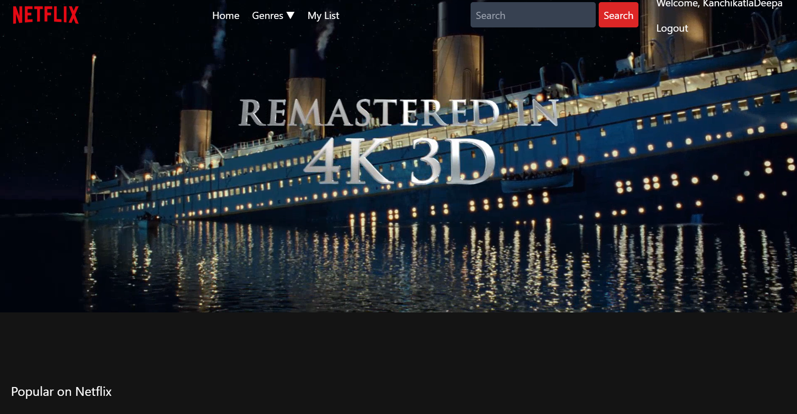
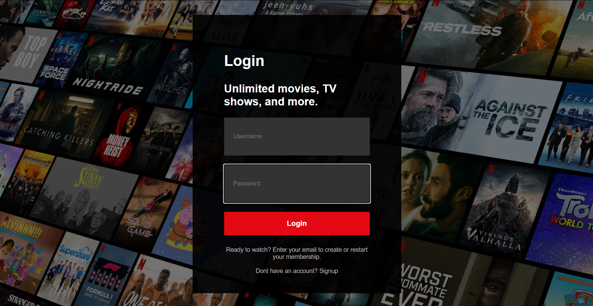
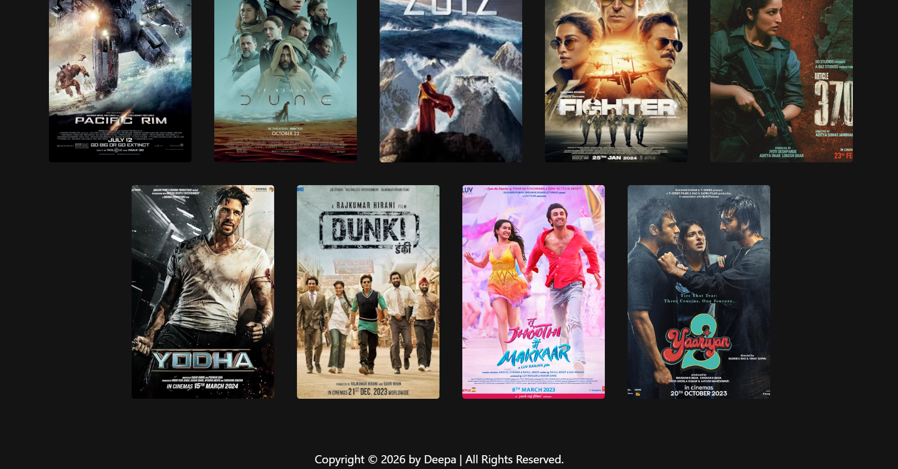

# Netflix_Clone_Wep_Application
A Netflix-inspired web application built using HTML, CSS, JavaScript, Django, and SQLite. Features include user authentication, movie browsing, genre filtering, search functionality, and personalized watchlists.

## Technologies Used
- Python
- Django
- HTML
- CSS
- JavaScript
- SQLite

## Features
- User Registration and Login
- Movie Listing
- Genre-Based Filtering
- Movie Search
- Personalized Watchlist

## Description
A Netflix-inspired web application that allows users to browse movies, search by title, filter by genre, and maintain a personalized watchlist.

## Author
Deepa Kanchikatla

## 📸 Screenshots

### Home Page

### Login Page

### Movie List Page

